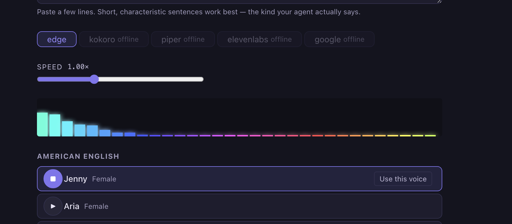

# Clarion

**Give your AI agent a voice.**

[](LICENSE)
[](https://github.com/celanthe/clarion/stargazers)
[](https://github.com/celanthe/clarion/commits/main)
[](https://github.com/celanthe/clarion)

Self-hosted TTS proxy and voice manager. Audition voices against your agent's actual dialogue, pick one, and pipe responses through it from the browser or CLI.

> Voice starts while your agent is still working. `clarion-watch` speaks each assistant message the moment it's written — even before tool calls finish.



---

## What it does

- **Live session voice.** `clarion-watch` speaks each assistant message as soon as it is written — including text before tool use. Voice starts while Claude is still working.
- **Audition voices.** Paste your agent's characteristic dialogue. Hear each voice read it. Pick the one that fits.
- **Save agent profiles.** One agent uses Kokoro `bm_george` at 1.0x, another uses Edge `en-GB-SoniaNeural`. Both saved, both exportable as JSON.
- **Six TTS backends.** Edge TTS (zero config), Kokoro (self-hosted, natural), Chatterbox (self-hosted, ElevenLabs-quality), Piper (self-hosted, lightweight), ElevenLabs (paid), Google Chirp 3 HD (paid).
- **Terminal integration.** Pipe agent responses through their voice from the CLI. Works with Claude Code via `clarion-watch` (live daemon) or the stop hook.
- **Multi-agent support.** Running several agents at once? Concurrent responses queue automatically and speak in the order they finished — no overlapping audio.

---

## Quickstart

Requires Node.js 18+ and npm. Start with UI only — it works out of the box. Add the server later if you want higher-quality voices.

### UI only (Edge TTS, no setup needed)

```sh
npm install
npm run dev
# http://localhost:5173
```

### With server (required for Kokoro, Piper, ElevenLabs, Google)

Run in a second terminal alongside the UI:

```sh
cd server && npm install && npm run dev
# http://localhost:8080
```

Or with Docker (Kokoro included):

```sh
docker compose up
# Kokoro at :8880, Clarion server at :8080
```

---

## Why Clarion?

Most TTS tools give you an API. Clarion gives you a workflow.

- **Audition, don't guess** — hear each voice read your agent's actual dialogue before you commit
- **Self-hosted** — your audio, your servers, your data
- **proseOnly** — strips code blocks, markdown, and structure so agents speak naturally, not robotically
- **Live voice** — `clarion-watch` speaks during the session, not after
- **Six backends** — swap from free (Edge) to premium (ElevenLabs) without changing a line of agent code
- **Multi-agent crews** — each agent gets its own voice, concurrent responses queue automatically

---

## Voice audition

1. Open the **Audition** tab
2. Paste your agent's characteristic dialogue
3. Select a backend (Kokoro for the most natural voices)
4. Click play next to a voice to hear it read your text
5. Click **Use this voice**, name the agent, done

Short, characteristic sentences work best. Paste what your agent would actually say, not generic test text.

---

## CLI

```sh
# Install globally (run once from the Clarion directory)
npm install -g .

# Set up your first agent (interactive — picks a voice, writes the hook)
clarion-init

# Speak as a saved agent
echo "The pattern holds." | clarion-speak --agent my-agent

# Stream in real time, sentence by sentence
claude "Walk me through this." | clarion-stream --agent my-agent

# Watch a Claude Code session live — speaks mid-session, before tools finish
clarion-watch --agent my-agent

# Multi-agent mode — one router watches all projects, routes each to the right voice
clarion-watch --multi

# Migrate voice configs from Terminus to Clarion
clarion-migrate --dry-run

# Diagnose setup issues — 10 checks with remediation hints
clarion-doctor

# Check server health, loaded agents, and playback status
clarion-status

# Mute an agent
clarion-mute my-agent
clarion-mute my-agent --off
```

[Full CLI guide](docs/cli.md): `clarion-doctor`, `clarion-init`, `clarion-speak`, `clarion-stream`, `clarion-watch`, `clarion-router`, `clarion-migrate`, `clarion-status`, `clarion-mute`, `clarion-log`, and the Claude Code stop hook.

---

## API

```
POST /speak
Body: { "text": "Hello.", "backend": "edge", "voice": "en-GB-RyanNeural", "speed": 1.0 }
Returns: audio/mpeg (X-Clarion-Fallback header if backend fell back to Edge)

GET /voices?backend=edge|kokoro|piper|elevenlabs|google|chatterbox
Returns: { voices: [{ id, label, lang, gender }] }

GET /health
Returns: { edge: "up", kokoro: "up|down|unconfigured", ... }

GET /diagnostics
Returns: { server: { version }, backends: { [name]: { status, configured, detail } } }
```

---

## Backends

| Backend | Config needed | Quality | Voices |
|---------|--------------|---------|--------|
| Edge TTS | None* | Good | 27 Neural (US, UK, AU, IE, CA, ZA, NZ, IN) |
| Kokoro | `KOKORO_SERVER=http://...` | Excellent | 11 (US + UK English) |
| Chatterbox | `CHATTERBOX_SERVER=http://...` | Excellent | Voice cloning — unlimited (requires GPU) |
| Piper | `PIPER_SERVER=http://...` | OK | 6 (US + UK English) |
| ElevenLabs | `ELEVENLABS_API_KEY=...` | Excellent | 11 (US, UK, AU) |
| Google Chirp 3 HD | `GOOGLE_TTS_API_KEY=...` | Excellent | 16 (US + UK) |

\*Edge TTS uses Microsoft's public Translator API. No API key is required, but this is an unofficial integration and availability is not guaranteed.

[Backend setup guide](docs/backends.md): local Kokoro and Piper install, Docker, API key setup.

---

## What gets spoken

By default (`proseOnly: true`), Clarion strips non-conversational markdown before sending text to the TTS backend — so your agent only speaks what it would actually say, not the structure around it.

| Content | Spoken? |
|---|---|
| Prose paragraphs | Yes |
| Heading text (`## Like this`) | Yes — markers stripped |
| Bold / italic / strikethrough | Yes — markers stripped |
| Links (`[text](url)`) | Yes — link text spoken |
| Images (``) | Yes — alt text spoken |
| Blockquotes (`> text`) | Yes — markers stripped |
| Bullet lists (`- item`) | Yes — markers stripped |
| Numbered lists (`1. item`) | Yes — markers stripped |
| Fenced code blocks (` ``` `) | No — removed |
| Inline code (`` `like this` ``) | No — removed |
| Indented code blocks | No — removed |
| HTML tags | No — removed |
| Horizontal rules (`---`) | No — removed |

Toggle **Prose only** off on any agent card if you want everything spoken verbatim — useful for agents that narrate code reviews or read structured output.

---

## Agent profiles

Profiles are stored in `localStorage` and exportable as JSON.

```json
{
  "id": "my-agent",
  "name": "My Agent",
  "backend": "kokoro",
  "voice": "bm_george",
  "speed": 1.0,
  "proseOnly": true
}
```

Export from the UI (Export all button) or share a single agent profile as a `.json` file. Import via the Import button.

---

## Deploy

**Cloudflare Worker** (Edge TTS only, or with secrets for paid backends):

```sh
cd server && wrangler deploy
wrangler secret put KOKORO_SERVER
wrangler secret put ELEVENLABS_API_KEY
wrangler secret put GOOGLE_TTS_API_KEY
```

**Docker Compose** (for local Kokoro):

```sh
docker-compose up
```

**Chatterbox on RunPod** (or any NVIDIA GPU server):

See [docs/chatterbox.md](docs/chatterbox.md) for the full setup guide.

---

## Troubleshooting

**No audio output?**
Edge TTS returns `audio/mpeg`. Make sure your player supports it. From CLI, Clarion auto-detects `afplay` (macOS), `mpv`, `ffplay`, `paplay`, or `cvlc` (Linux). On Windows, `mpv`, `ffplay`, or `vlc` are detected. Pass `--player <command>` to override.

**Kokoro connection refused?**
Check `KOKORO_SERVER` is set and the server is running on the right port. Docker: `docker-compose up` handles this automatically. Verify with `clarion-status`.

**`clarion-watch` not speaking?**
Run `clarion-log` to check recent entries. Make sure the agent profile exists: `clarion-speak --list-agents`. Check mute state: `clarion-mute --list`.

**Audio overlapping between agents?**
`clarion-stream` uses a process lock file to serialize playback. If a stale lock remains after a crash, delete `$TMPDIR/clarion-stream.lock`.

---

## Security

Clarion is designed for personal, self-hosted use. For deployments beyond localhost:

- Set `API_KEY=your-secret` in the server environment. The browser UI signs requests with HMAC-SHA256. The CLI uses `Bearer <key>`. Use HTTPS for remote deployments.
- CORS is open (`*`) by default. Set `ALLOWED_ORIGIN=https://your-domain.com` to restrict it.
- `kokoro-server.py` and `piper-server.py` bind to `127.0.0.1` by default. Do not expose them on `0.0.0.0` unless you trust the network.

---

## Privacy

Clarion sends the text you provide to whichever TTS backend is selected. **Edge TTS, ElevenLabs, and Google Chirp 3 HD** route text through external APIs (Microsoft, ElevenLabs, and Google respectively). **Kokoro, Chatterbox, and Piper** are fully self-hosted — text never leaves your infrastructure. Choose your backend accordingly. No text is stored by the Clarion server.

---

## Ecosystem

Clarion is part of the [zerovector.design](https://zerovector.design) ecosystem — tools for building directly from intent to artifact. See also [Terminus](https://github.com/celanthe/terminus), the zero-overhead orchestration layer for multi-agent workflows.

---

## Contributing

Issues and pull requests are welcome. See [CONTRIBUTING.md](CONTRIBUTING.md) for setup, code style, and how to add a backend.

Clarion is an audio tool, but contributions are not limited to people who use audio. UI improvements, backend adapters, documentation, and testing are all valuable.

---

## Credits

Built by [celanthe](https://github.com/celanthe) · Design by [Zabethy](https://zabethy.com) · Inspired by [Investiture](https://zerovector.design/investiture) by [Erika Flowers](https://github.com/erikaflowers) and [Everbloom Reader](https://everbloomreader.com)

[](https://ko-fi.com/rinoliver)
